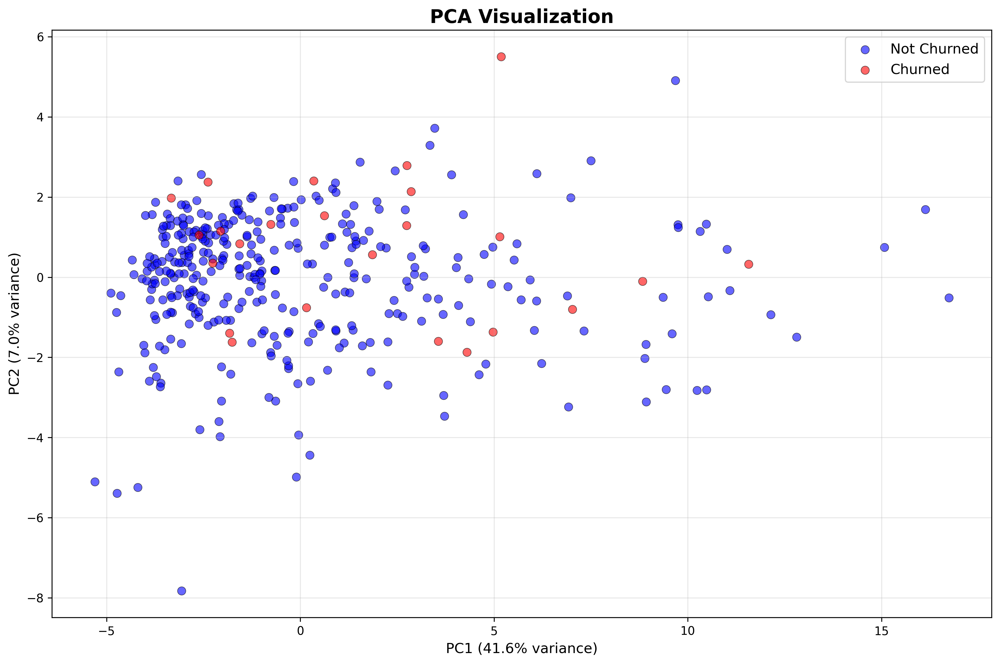
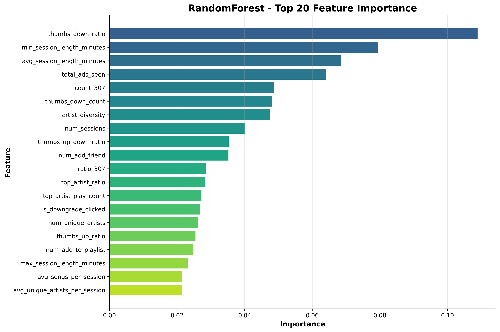

# Customer Churn Prediction Library

<p align="center">
  
  
  
  
  
</p>

A production-ready machine learning pipeline for predicting customer churn in music streaming services. Built with extensible abstract base classes, comprehensive feature engineering, time-based validation, and MLflow experiment tracking.

---

## Table of Contents

- [Problem Definition](#problem-definition)
- [Key Architectural Decisions](#key-architectural-decisions)
- [Project Structure](#project-structure)
- [Data Pipeline](#data-pipeline)
- [Feature Engineering](#feature-engineering)
- [Model Architecture](#model-architecture)
- [Training Strategy](#training-strategy)
- [Installation](#installation)
- [Usage](#usage)
- [Results & Visualizations](#results--visualizations)
- [Business Context](#business-context)
- [Future Improvements](#future-improvements--production-considerations)

---

## Problem Definition

### What is Churn?

We define **churn as strict cancellation**, not just downgrade. This decision is critical because:

- Whether a user upgrades or stays on free tier, the platform still earns ad revenue
- **Cancellation = Complete revenue loss** (no subscription fees AND no ad revenue)
- This approach prioritizes catching users who will completely leave the platform

### Churn Detection Event

```json
{
  "ts": 1539016481000,
  "userId": "154",
  "page": "Cancellation Confirmation",
  "auth": "Cancelled",
  "level": "free"
}
```

A user is labeled as **churned** when they hit the `"Cancellation Confirmation"` page with `"auth": "Cancelled"`.

---

## Key Architectural Decisions

### 1. Abstract Base Class (ABC) Pattern

The entire ML pipeline is built on Python's ABC pattern, enabling **pluggable components**:

```
┌─────────────────────────────────────────────────────────────────┐
│                    ML Training Architecture                     │
├─────────────────────────────────────────────────────────────────┤
│                                                                 │
│   ┌──────────────────┐      ┌──────────────────┐                │
│   │ BaseFeature      │      │ BaseModel        │                │
│   │ Generator        │      │                  │                │
│   │  (ABC)           │      │  (ABC)           │                │
│   └────────┬─────────┘      └────────┬─────────┘                │
│            │                         │                          │
│     ┌──────┴──────┐           ┌──────┴────────────────────┐     │
│     │             │           │                           │     │
│  FeatureSet1  FeatureSet2   LGBM  XGBoost  RF  CatBoost  SVM    │
│  (38 features) (90 features)                                    │
│                                                                 │
│   ┌──────────────────────────────────────────────┐              │
│   │              MLFlowTrainer                    │             │
│   │  - Time-based validation                      │             │
│   │  - Grid search with rolling windows           │             │
│   │  - Experiment tracking                        │             │
│   └──────────────────────────────────────────────┘              │
└─────────────────────────────────────────────────────────────────┘
```

### 2. Time-Based Validation (No Data Leakage!)

One of the most critical decisions: **We NEVER use future data to predict the past.**

```
Timeline:  ────────────────────────────────────────────────────►

           ┌─────────────────────┐ ┌──────────────┐
  Week 1:  │  Observation Window │ │ Label Window │
           │     (28 days)       │ │  (14 days)   │
           └─────────────────────┘ └──────────────┘
                                 ▲
                            Cutoff Date

           ─────────┌─────────────────────┐ ┌──────────────┐
  Week 2:           │  Observation Window │ │ Label Window │
                    └─────────────────────┘ └──────────────┘
                                          ▲
                                     Cutoff Date (+ 7 days)
```

**Why this matters:**
- Prevents data leakage that would artificially inflate metrics
- Simulates production conditions where we only have historical data
- Since the number of churn users are small, 14 days give the model and the busniness more robust prediction

#### Why Sliding Window over Expanding Window?

We chose **sliding window** over expanding window for three key reasons:

| Reason | Explanation |
|--------|-------------|
| **Signal Dilution** | Expanding windows dilute recent signals with old data |
| **Relevance** | User behavior patterns change over time; recent data is more predictive |
| **Consistency** | Fixed window size ensures consistent feature distributions across time |

### 3. User-Level Train/Test Split

Users are split **once at the beginning** and remain in their groups across all time windows:

```python
# 70% training, 30% holdout - PERMANENTLY
train_users, test_users = trainer.split_users(all_users)
```

**Why:** Prevents training on a user in week 1 and testing on them in week 2, which would leak information.

### 4. F1 Optimization with Recall Preference

We optimize primarily for **F1 score**, but when in doubt between models with similar F1, we favor **Recall over Precision**:

> "It's better to accidentally give a coupon to a happy user (False Positive) than to let an unhappy user leave (False Negative)."


### 5. Class Imbalance Handling

With only ~99 churned users out of 448, we handle class imbalance through:

| Strategy | Implementation |
|----------|---------------|
| **BalancedRandomForestClassifier** | Built-in undersampling |
| **Class Weights** | `class_weight='balanced'` |
| **SMOTE** | Synthetic minority oversampling |
| **scale_pos_weight** | XGBoost parameter tuning |


### 6. Optimal Threshold Search

Instead of using the default 0.5 threshold, we use a **two-pass approach** to find the optimal threshold:

1. **First pass:** Collect predictions from all validation weeks
2. **Second pass:** Find the threshold that maximizes average F1 across ALL weeks, then apply it

```python
thresholds = [0.1, 0.15, 0.2, 0.25, 0.3, 0.35, 0.4, 0.45, 0.5, ...]
# Find threshold that maximizes average F1 across all validation windows
```

This ensures consistent threshold selection rather than per-week optimization.

### 7. Runtime Type Validation

The `MLFlowTrainer` validates inputs at runtime to enforce the ABC pattern:

```python
if not isinstance(feature_generator, BaseFeatureGenerator):
    raise TypeError("feature_generator must be an instance of BaseFeatureGenerator")

if not issubclass(model_class, BaseModel):
    raise TypeError("model_class must be a subclass of BaseModel")
```

### 8. Reproducibility & Determinism

All randomness is controlled for reproducibility:
- User IDs are **sorted before shuffling** with a fixed `random_state`
- All models receive the same `random_state` parameter
- SMOTE uses the same `random_state` for synthetic sample generation

### 9. Parallel Processing

All models utilize all CPU cores by default (`n_jobs=-1`) for faster training:
- XGBoost, LightGBM, Random Forest, CatBoost all parallelize tree building
- Can be overridden via the `params` dictionary

### 10. SVM Pipeline Architecture

The Linear SVM model uses a special pipeline for compatibility:

```
┌─────────────────────────────────────────────────────────────────┐
│                    LinearSVM Pipeline                           │
├─────────────────────────────────────────────────────────────────┤
│                                                                 │
│  Input Features                                                 │
│       │                                                         │
│       v                                                         │
│  ┌─────────────────┐                                            │
│  │  StandardScaler │  <-- SVMs are sensitive to feature scaling │
│  └────────┬────────┘                                            │
│           │                                                     │
│           v                                                     │
│  ┌─────────────────┐                                            │
│  │    LinearSVC    │  <-- Fast linear SVM                       │
│  └────────┬────────┘                                            │
│           │                                                     │
│           v                                                     │
│  ┌─────────────────────────┐                                    │
│  │  CalibratedClassifierCV │  <-- Enables predict_proba()       │
│  └─────────────────────────┘      for threshold search          │
│                                                                 │
└─────────────────────────────────────────────────────────────────┘
```

### 11. Dry Run Mode

MLflow logging can be disabled for local testing:

```python
trainer = MLFlowTrainer(
    ...
    enable_mlflow=False,  # Dry run - no MLflow logging
)
```

Uses Python's `nullcontext()` to avoid MLflow calls while maintaining code flow.

### 12. Auto-Generated Experiment Names

If no experiment name is provided, it's auto-generated:

```python
experiment_name = f"churn_task_{model_name}_{features_name}"
# e.g., "churn_task_XGBoostSMOTEModel_FeatureSet2"
```

### 13. Missing Value Handling

Features with NaN values are filled with 0 before training:

```python
X_train = X_train.fillna(0)
X_test = X_test.fillna(0)
```

### 14. Data Pre-sorting

Data is sorted by timestamp **once at load time** to ensure all temporal features work correctly:

```python
self.df = self.df.sort_values("ts_dt").reset_index(drop=True)
```

### 15. Active Users Only Filtering

Feature generation excludes users who have already cancelled by the cutoff date, preventing label leakage:

```python
# Identify cancelled users within the observation window
cancelled_users = set(df[df["page"] == "Cancellation Confirmation"]["userId"].unique())

# Filter them out
if active_users_only:
    df = df[~df["userId"].isin(cancelled_users)]
```

---

## Project Structure

```
churn_library/
├── data_clean_process/              # Data preprocessing pipeline
│   ├── customer_churn.json          # Raw JSONL event logs (~544K records)
│   ├── customer_churn_cleaned.json  # Cleaned data (~542K records, 99.71% retention)
│   ├── step1_analyze_jsonl.py       # Data exploration & field analysis
│   ├── step2_validate_required.py   # Required fields & session-user mapping
│   ├── step3_check_cancelled_users.py # Verify no post-cancellation activity
│   ├── step4_clean_data.py          # Main cleaning pipeline (3-pass algorithm)
│   ├── step5_visualize_timestamp_and_data.py # Timeline visualizations
│   ├── event_timeline.png           # Events & cancellations per day
│   └── event_timeline_overlay.png   # Combined overlay visualization
│
├── ml_training/                     # Core ML package
│   ├── __init__.py                  # Package exports
│   ├── main.py                      # Training entry point (with grid search)
│   ├── main_visualizer.py           # Training with visualizations (PCA, feature importance)
│   ├── mlflow_trainer.py            # Time-based validation & MLflow tracking
│   ├── mlflow_tracking_uri.py       # MLflow URI configuration helper
│   │
│   ├── features/                    # Feature engineering module
│   │   ├── __init__.py
│   │   ├── base_features.py         # Abstract BaseFeatureGenerator
│   │   ├── feature_set1.py          # 38 hand-crafted features
│   │   └── feature_set2.py          # 90 features (extends Set1 with 52 more)
│   │
│   ├── models/                      # Model implementations
│   │   ├── __init__.py
│   │   ├── base_model.py            # Abstract BaseModel
│   │   ├── rf_model.py              # Random Forest (+ Balanced RF)
│   │   ├── xgboost_model.py         # XGBoost with class weights
│   │   ├── xgboost_smote_model.py   # XGBoost + SMOTE oversampling
│   │   ├── lgbm_model.py            # LightGBM
│   │   ├── catboost_model.py        # CatBoost
│   │   └── svm_model.py             # Linear SVM with calibration
│   │
│   └── images/                      # Generated visualizations
│       ├── pca_visualization.png
│       ├── feature_importance_RandomForest.png
│       └── feature_importance_XGBoostSMOTE.png
│
├── pyproject.toml                   # Package configuration & dependencies
├── requirements.txt                 # Pip requirements
├── env.example                      # Environment variables template
└── my_notes.txt                     # Project notes & decisions log
```

---

## Data Pipeline

### Raw Data Overview

> **Note:** Despite the `.json` extension, the data file is actually in **JSONL format** (JSON Lines - one JSON object per line).

| Metric | Value |
|--------|-------|
| Total Records | 543,705 |
| Unique Users | 448 |
| Date Range | Oct 1 - Dec 1, 2018 (62 days) |
| Cancelled Users | 99 |
| Event Types | 22 different page events |

### Event Types Captured

```
About, Add Friend, Add to Playlist, Cancel, Cancellation Confirmation,
Downgrade, Error, Help, Home, Login, Logout, NextSong, Register,
Roll Advert, Save Settings, Settings, Submit Downgrade, Submit Registration,
Submit Upgrade, Thumbs Down, Thumbs Up, Upgrade
```

### Data Fields (18 total)

| Field | Description | Example |
|-------|-------------|---------|
| `ts` | Timestamp (milliseconds) | 1538352117000 |
| `userId` | User identifier | "100001" |
| `sessionId` | Session identifier | 1035 |
| `page` | Event/page type | "NextSong" |
| `auth` | Authentication status | "Logged In", "Cancelled" |
| `level` | Subscription level | "free", "paid" |
| `itemInSession` | Item number in session | 17 |
| `song` | Song name | "Californication" |
| `artist` | Artist name | "Red Hot Chili Peppers" |
| `length` | Song length (seconds) | 321.54 |
| `location` | User location | "San Francisco-Oakland-Hayward, CA" |
| `userAgent` | Browser/device info | "Mozilla/5.0..." |
| `gender` | User gender | "M", "F" |
| `registration` | Registration timestamp | 1538048434000 |
| `firstName` | First name | "Oliver" |
| `lastName` | Last name | "Fry" |
| `method` | HTTP method | "GET", "PUT" |
| `status` | HTTP status code | 200, 307, 404 |

### Cleaning Pipeline (4-Step Process)

#### Step 1: Data Analysis (`step1_analyze_jsonl.py`)
- Scans all 543K records
- Identifies 18 unique fields
- Catalogs unique values per field
- Identifies potential data quality issues

#### Step 2: Validation (`step2_validate_required.py`)
- Validates required fields: `ts`, `sessionId`, `page`, `auth`, `level`, `itemInSession`
- **Key Finding:** Sessions are reused across users (68.6% of sessions have multiple users!)
- Validates data integrity: number of unique `userId` values should match unique `registration` values
- This requires special handling in the cleaning phase

> **Key Challenge:** "One of the hardest problems is attaching sessions to userID. In production systems, sessions should be unique and must not be reattached to userID after logout. I had to examine the data to notice that I can use `itemInSession` decreases as a session reset flag."

#### Step 3: Cancellation Check (`step3_check_cancelled_users.py`)
- Verifies no cancelled users logged in again
- **Result:** 0 users returned after cancellation
- This confirms we can safely remove post-cancellation records

#### Step 4: Data Cleaning (`step4_clean_data.py`)

A sophisticated **3-pass algorithm**:

```
┌─────────────────────────────────────────────────────────────────┐
│                    3-Pass Cleaning Algorithm                    │
├─────────────────────────────────────────────────────────────────┤
│                                                                 │
│  PASS 1: Build Session-User Mapping                             │
│  ─────────────────────────────────────────                      │
│  • Track (sessionId, timestamp_range) -> userId                 │
│  • Use itemInSession DECREASES to detect new users              │
│  • Created 6,080 segments from 4,470 sessions                   │
│  • Detected 1,610 itemInSession resets                          │
│                                                                 │
│  PASS 2: Find Cancellation Timestamps                           │
│  ─────────────────────────────────────────                      │
│  • Map each userId -> their cancellation timestamp              │
│  • Found 99 users with cancellations                            │
│                                                                 │
│  PASS 3: Clean & Write                                          │
│  ─────────────────────────────────────────                      │
│  • Remove Guest auth records (94 removed)                       │
│  • Fill missing userId from session segments                    │
│  • Remove unfillable userId records (1,466 removed)             │
│  • Remove post-cancellation records (0 removed)                 │
│                                                                 │
└─────────────────────────────────────────────────────────────────┘
```

**Cleaning Results:**

| Metric | Count |
|--------|-------|
| Total lines read | 543,705 |
| Guest records removed | 94 |
| Empty userId filled | 14,140 |
| Unfillable userId removed | 1,466 |
| Records written | 542,145 |
| **Data retention rate** | **99.71%** |

---

## Feature Engineering

### FeatureSet1 (38 Features)

Base feature set with comprehensive user behavior analysis:

| Category | Features | Count |
|----------|----------|-------|
| **Song Interaction** | total_songs_played, thumbs_up/down counts & ratios, avg_song_length | 7 |
| **Session** | num_sessions, avg_songs_per_session, session_length (avg/max/min) | 5 |
| **Device** | is_mobile, is_desktop, is_both_mobile_desktop | 3 |
| **HTTP Status** | count_404, count_307, count_200, ratio_404, ratio_307 | 5 |
| **Engagement** | total_ads_seen, ads_per_session, avg_unique_artists_per_session | 3 |
| **User Actions** | add_friend, add_to_playlist, about/settings/help page visits, downgrade/upgrade clicks | 9 |
| **Song Strings** | unique_artists, unique_songs, song/artist diversity, top_artist metrics | 6 |

### FeatureSet2 (90 Features) - Extends FeatureSet1

> **Evolution Note:** "I noticed FeatureSet1 (hand-crafted features) was not enough. I looked in literature for more features and crafted FeatureSet2 with temporal and trend-based features that are critical for churn prediction."

**Inheritance Pattern:** FeatureSet2 extends FeatureSet1 using Python's class inheritance, calling `super()._generate_user_features()` to get all 38 base features before adding its own 52 features. This allows easy experimentation with different feature sets.

Adds 52 critical churn prediction features:

| Category | Features | Count |
|----------|----------|-------|
| **Temporal/Recency** | days_since_last_activity, hours_since_last_activity, account_age, active_days metrics, session gap analysis | 12 |
| **Engagement Trends** | early vs recent period comparisons for songs, sessions, active_days, events, thumbs_up trend | 15 |
| **Subscription/Demographics** | is_paid_user, level_changed, gender flags, location_hash | 5 |
| **Additional Events** | home visits, login/logout counts, error page, save settings, event ratios | 9 |
| **Time Patterns** | hour diversity, day of week diversity, weekend vs weekday activity, peak hour analysis, daily activity variance | 11 |

#### Key Trend Features (Critical for Churn Detection!)

```python
# Detecting declining engagement - split observation window in half
early_period = user_df[user_df['ts_dt'] < mid_point]
recent_period = user_df[user_df['ts_dt'] >= mid_point]

features['songs_trend_ratio'] = recent_songs / (early_songs + 1)  # <1 = declining!
features['sessions_trend_ratio'] = recent_sessions / (early_sessions + 1)
features['active_days_trend_ratio'] = recent_days / (early_days + 1)
```

---

## Model Architecture

### Supported Models

| Model | Class | Key Features |
|-------|-------|--------------|
| **Random Forest** | `RandomForestModel` | Uses `BalancedRandomForestClassifier` for class imbalance |
| **XGBoost** | `XGBoostModel` | `scale_pos_weight` for class imbalance |
| **XGBoost + SMOTE** | `XGBoostSMOTEModel` | SMOTE oversampling before training |
| **LightGBM** | `LGBMModel` | `class_weight='balanced'` |
| **CatBoost** | `CatBoostModel` | `auto_class_weights='Balanced'` |
| **Linear SVM** | `LinearSVMModel` | Calibrated for probability outputs |

### Base Model Interface

```python
class BaseModel(ABC):
    @abstractmethod
    def fit(self, X, y): pass

    @abstractmethod
    def predict(self, X): pass

    @abstractmethod
    def predict_proba(self, X): pass

    def get_feature_importance(self):
        # Returns feature importances if available
```

### Parameter Grids (Optimized for Small Sample Sizes)

Since we only have 11-14 churned users per validation window, parameters are tuned conservatively:

```python
# XGBoost Example
param_grid = {
    "n_estimators": [50, 100, 200],
    "max_depth": [3, 4, 5],           # Shallow trees for small data
    "learning_rate": [0.01, 0.05],
    "min_child_weight": [0.5, 1, 2],  # Allow small leaf sizes
}
```

---

## Training Strategy

### Walk-Forward Validation

```
Cutoff Dates (starting Oct 29, 2018):
  Window 1: 2018-10-29
  Window 2: 2018-11-05  (+7 days)
  Window 3: 2018-11-12  (+14 days)
  Window 4: 2018-11-19  (+21 days)
```

### Training Configuration

```python
trainer = MLFlowTrainer(
    feature_generator=feature_gen,
    model_class=XGBoostSMOTEModel,
    observation_window_days=28,    # Look back 4 weeks for features
    label_window_days=14,          # Predict churn 2 weeks ahead
    test_size=0.3,                 # 30% holdout
    random_state=42,               # Reproducibility
)
```

### Why 2-Week Label Window?

> "1 week prediction is not enough since we will get some weeks with 1 to 3 churn, making the prediction non solid. As a result, I've adjusted it to be 1 week move forward and training, with 2 weeks prediction forward (before sending a please stay email beforehand)."

### Why Start from Oct 29?

The cutoff dates start from **October 29, 2018** to:
- Keep **seasonality in mind** when using rolling windows
- Ensure sufficient data in the observation window (28 days back from Oct 29 = Oct 1, the start of data)
- Allow 4 validation windows within the 2-month dataset

### Known Limitations

> "Unfortunately, we use the 4 weeks as validation since we have very small data (2 months). If it were up to me, I would choose another month as a separate test set."

This is a trade-off due to limited data availability. In production, a separate holdout month would be recommended.

### Grid Search Process

```
┌────────────────────────────────────────────────────────────────┐
│                     Grid Search Process                         │
├────────────────────────────────────────────────────────────────┤
│                                                                 │
│  For each parameter combination:                                │
│    │                                                            │
│    |---> For each time window (Week 1-4):                       │
│    │     │                                                      │
│    │     |---> Generate features (observation window)           │
│    │     |---> Generate labels (label window)                   │
│    │     |---> Split by pre-defined train/test users            │
│    │     |---> Train model on train users                       │
│    │     |---> Collect predictions on test users                │
│    │                                                            │
│    |---> Find optimal threshold across all weeks                │
│    |---> Calculate metrics with optimal threshold               │
│    |---> Log to MLflow (params + per-week metrics)              │
│                                                                 │
│  Return best parameters (highest average F1)                    │
│                                                                 │
└────────────────────────────────────────────────────────────────┘
```

---

## Installation

### Prerequisites

- Python 3.10+
- pip or uv

### Using pip

```bash
# Clone the repository
git clone https://github.com/lcsig/customer_churn.git
cd customer_churn

# Create virtual environment
python -m venv .venv
source .venv/bin/activate  # Linux/Mac
# or .venv\Scripts\activate  # Windows

# Install dependencies
pip install -r requirements.txt

# Or install as package
pip install -e .
```

### Using uv (Recommended)

```bash
# Install uv if you haven't
pip install uv

# Create environment and install
uv sync
```

### Optional Dependencies

```bash
# For development
pip install -e ".[dev]"

# For production (FastAPI, Redis)
pip install -e ".[production]"
```

---

## Usage

### Environment Setup

```bash
# Activate virtual environment
source venv/bin/activate

# Load environment variables (MLflow credentials)
source .env
```

### 1. Data Cleaning (One-time)

```bash
# Step 1: Analyze raw data
uv run data_clean_process/step1_analyze_jsonl.py

# Step 2: Validate fields
uv run data_clean_process/step2_validate_required.py

# Step 3: Check cancellation patterns
uv run data_clean_process/step3_check_cancelled_users.py

# Step 4: Clean data
uv run data_clean_process/step4_clean_data.py

# Step 5: Visualize timeline
uv run data_clean_process/step5_visualize_timestamp_and_data.py
```

### 2. Training with Grid Search

```bash
uv run ml_training/main.py
```

### 3. Training with Visualizations

```bash
uv run ml_training/main_visualizer.py
```

### 4. MLflow Setup

```bash
# Copy environment template and edit with your MLflow server details
cp env.example .env

# Example .env contents:
# export MLFLOW_TRACKING_URI=http://127.0.0.1:5000
# export MLFLOW_USERNAME=your_username
# export MLFLOW_PASSWORD=your_password

# Start MLflow UI locally (optional, for local tracking)
mlflow ui --port 5000
```

**What gets logged to MLflow:**
- **Parameters:** model_class, observation_window_days, label_window_days, all hyperparameters, optimal_threshold
- **Metrics:** avg_f1_score, avg_precision, avg_recall, avg_accuracy, num_weeks_evaluated
- **Per-week metrics:** week_1_f1, week_1_precision, week_1_recall, week_2_f1, etc.

### 5. Python API Usage

```python
from ml_training import FeatureSet2, XGBoostSMOTEModel, MLFlowTrainer
from datetime import datetime

# Load data
feature_gen = FeatureSet2("data_clean_process/customer_churn_cleaned.json")
feature_gen.load_data()

# Configure trainer
trainer = MLFlowTrainer(
    feature_generator=feature_gen,
    model_class=XGBoostSMOTEModel,
    observation_window_days=28,
    label_window_days=14,
)

# Split users
all_users = feature_gen.df["userId"].unique()
train_users, test_users = trainer.split_users(all_users)

# Generate cutoff dates
cutoff_dates = trainer.generate_cutoff_dates(
    start_date=datetime(2018, 10, 29),
    windows_count=4,
    interval_days=7
)

# Run grid search
results = trainer.grid_search_with_time_validation(
    param_grid={
        "n_estimators": [50, 100],
        "max_depth": [3, 5],
    },
    cutoff_dates=cutoff_dates
)

print(f"Best F1: {results['best_avg_f1']:.4f}")
print(f"Best Params: {results['best_params']}")
```

---

## Results & Visualizations

### PCA Visualization

The 2D PCA projection shows how churned vs non-churned users are distributed in the feature space:



### Feature Importance (Random Forest)

Top features identified by the Random Forest model for predicting churn:



### Generated Artifacts

| File | Description |
|------|-------------|
| `images/pca_visualization.png` | 2D PCA of feature space (churned vs non-churned) |
| `images/feature_importance_*.png` | Top 20 features by importance |
| `data_clean_process/event_timeline.png` | Events per day visualization |
| `data_clean_process/event_timeline_overlay.png` | Events + cancellations overlay |

### Data Statistics

```
Date Range:        Oct 1 - Dec 1, 2018 (62 days)
Total Events:      542,145
Average per Day:   8,744
Cancellations:     99 total
Churn Rate:        ~22% (99/448 users)
```

---

## Business Context

### Why This Matters

1. **Proactive Retention:** Predict churn 2 weeks in advance to enable intervention
2. **Targeted Marketing:** Send personalized "please stay" offers to at-risk users
3. **Revenue Protection:** Each saved user = continued subscription/ad revenue

### Recommended Actions for Predicted Churners

- Personalized discount offers
- Feature highlight emails
- Engagement campaigns (playlists, new releases)
- Customer success outreach

---

## Configuration

### Environment Variables

```bash
# MLflow tracking server
MLFLOW_TRACKING_URI=http://127.0.0.1:5000

# Optional: Basic auth credentials
MLFLOW_USERNAME=admin
MLFLOW_PASSWORD=secret
```

### Hyperparameter Tuning Tips

For small datasets (like this one with ~99 churners):

1. Use shallow trees (`max_depth=3-5`)
2. Lower `min_samples_leaf` / `min_child_samples` to `[1, 2, 3, 5]`
3. Use class balancing techniques
4. Consider ensemble methods

---

## Future Improvements & Production Considerations

### Location Feature Enhancement
Currently, location is hashed as-is. Future improvements should:
- Convert location to country level (handles VPN usage)
- Address location changes (password sharing detection)
- Consider regional seasonality patterns

### Production Microservice Architecture

```
┌─────────────────────────────────────────────────────────────────┐
│                  Production System Design                        │
├─────────────────────────────────────────────────────────────────┤
│                                                                  │
│  ┌─────────┐    ┌──────────────┐    ┌─────────────────┐         │
│  │ Events  │--->│ Feature      │--->│ Churn Prediction│         │
│  │ Stream  │    │ Store (Redis)│    │ Service         │         │
│  └─────────┘    └──────────────┘    └────────┬────────┘         │
│                                              │                   │
│                                              v                   │
│                                    ┌─────────────────┐          │
│                                    │ Retention       │          │
│                                    │ Campaign API    │          │
│                                    └─────────────────┘          │
│                                                                  │
│  Data flow: Receive events by sessionId -> Update features      │
│             -> Run prediction -> Trigger retention actions       │
│                                                                  │
└─────────────────────────────────────────────────────────────────┘
```

The production dependencies (`fastapi`, `redis`, `uvicorn`) are included in https://github.com/lcsig/customer_churn_api.

### MLflow Deployment

For cloud-based MLflow tracking, see: [mlflow-gcp](https://github.com/lcsig/mlflow-gcp)

### Additional Model Improvements

- [ ] **Dual-Model Strategy for Business Segmentation:**
  - Train a **high-recall model** to catch all potential churners (cast a wide net)
  - Train a **high-precision model** to identify users most certain to churn
  - Business can then apply different interventions:
    - High-recall predictions: Light-touch campaigns (emails, in-app notifications)
    - High-precision predictions: High-value interventions (personal calls, premium discounts)
  - This allows cost-effective resource allocation based on prediction confidence
- [ ] Add time-series specific models (LSTM, Transformer)
- [ ] Implement drift detection for model monitoring
